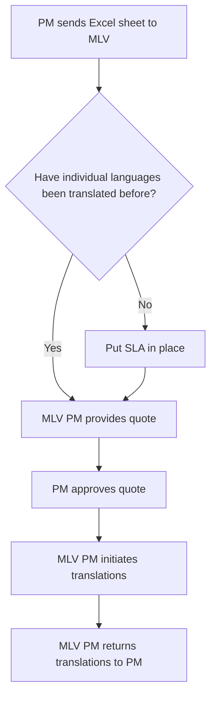
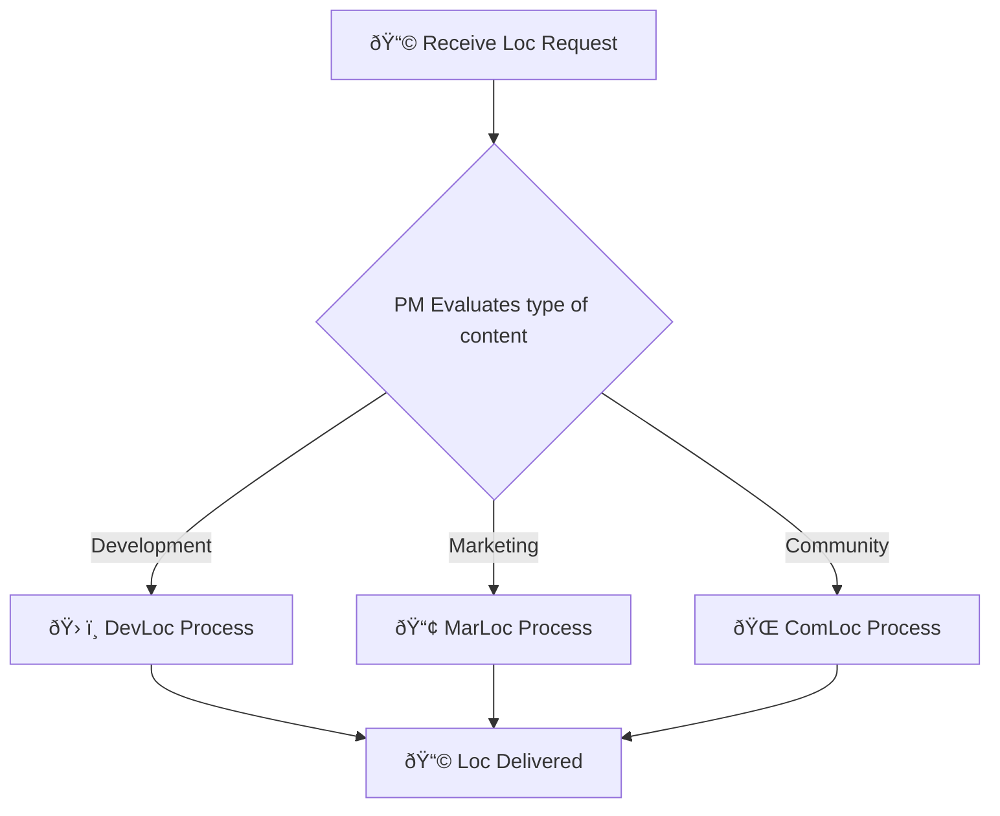

```mermaid
graph TD
    A[PM sends Excel sheet to MLV] --> B{Have individual languages been translated before?}
    B -- Yes --> C[MLV PM provides quote]
    B -- No --> D[Put SLA in place] --> C
    C --> E[PM approves quote]
    E --> F[MLV PM initiates translations]
    F --> G[MLV PM returns translations to PM]
```

```mermaid
graph TD
    A[📩 Receive Loc Request] --> B{PM Evaluates type of content}
    B -- Development --> C[ðŸ› ï¸ DevLoc Process]
    B -- Marketing --> D[📢 MarLoc Process]
    B -- Community --> E[🌠ComLoc Process]
    
    C --> F[📩 Loc Delivered]
    D --> F
    E --> F
```
